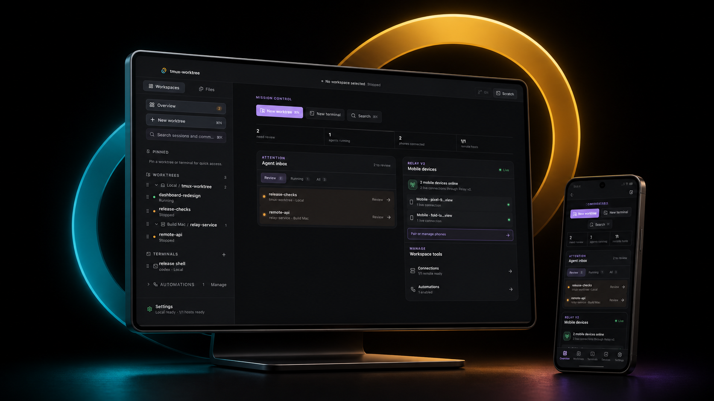
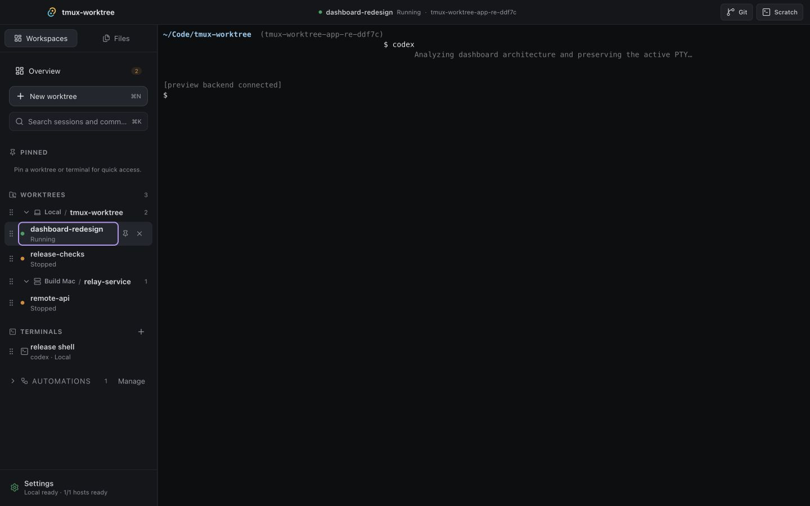
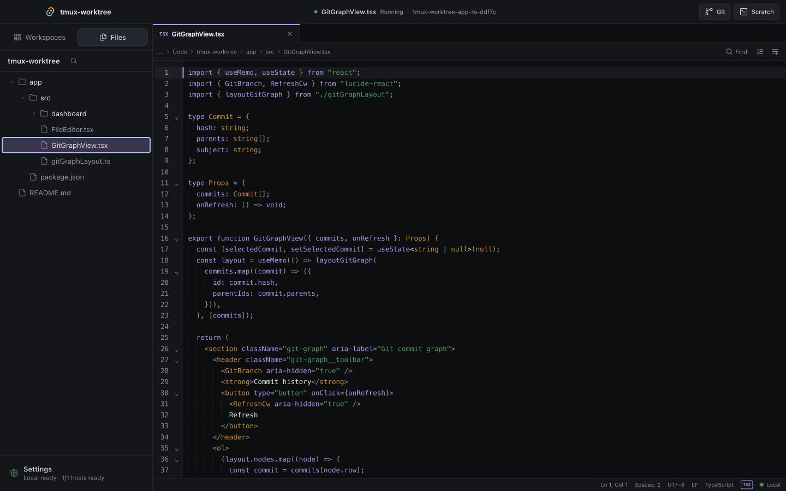

<p align="center">
  
</p>

<h1 align="center">TW — Agent Mission Control</h1>

<p align="center">
  <strong>你的 Agent。你的机器。一张控制台。</strong><br />
  让 AI 编码 Agent 在彼此隔离的 worktree 中并行工作；从 Mac、Android 或飞书查看进展、接管终端、审查代码。
</p>

<p align="center">
  <a href="README.md">English</a>
  <span> · </span>
  <a href="https://github.com/Sskift/tmux-worktree/releases/latest">下载 macOS 版</a>
  <span> · </span>
  <a href="docs/quickstart.md">快速开始</a>
  <span> · </span>
  <a href="docs/demo.md">启动交互 Demo</a>
</p>

<p align="center">
  <a href="docs/demo.md">
    
  </a>
</p>

<p align="center"><strong>▶ 启动交互式产品 Demo</strong></p>

---

## AI 在跑，你不必守着。

编码 Agent 改变了瓶颈。难点不再是启动一个 Agent，而是同时推进多个任务，又不丢掉分支、终端、机器与未完成的对话。

TW 给每个任务一块真正隔离的工作区，再把所有活跃任务带进同一张原生控制台。多启动一些工作，少巡视几个终端；只有真正需要判断时，再回到任务。


## 一个任务，一块真正隔离的工作区。

选择仓库、基线分支、Agent 与目标机器。TW 会创建专属 branch、Git worktree 和受管理的 tmux session。多个 Agent 可以同时工作，不共用 checkout，也不会让未提交修改彼此污染。

TW 可以探测目标机器上的 Claude Code、Codex、Gemini CLI、OpenCode、Aider 与 Kimi Code。需要人工操作时，普通 shell terminal 也和 Agent workspace 并排存在。

## 不再巡视终端，只看需要你的任务。

Mission Control 把许多终端窗口变成一条注意力队列。本机和 SSH 主机上的任务，谁在运行、谁有新输出、谁等你审阅，一眼就能看到。Agent Inbox 主动把下一次决策送到你面前。



## 在工作发生的地方审查工作。

终端、文件树、编辑器、Git 状态、diff 与 commit graph 都属于同一个 worktree。从 Agent 的结果到确切源码与分支，不必再去另一款应用里重新拼上下文。

<table>
  <tr>
    <td width="50%"></td>
    <td width="50%"></td>
  </tr>
</table>

## 离开电脑，不离开任务。

TW 可以连接眼前的 Mac、远处的 SSH devbox、Android 客户端与飞书群聊。Relay v2 让已配对手机看到同一份受管理任务目录；飞书绑定则让团队在选定的本机 Agent session 中继续追问，并在会话中收到结果。

目标级 input ownership lease 与 fencing 会保护终端输入，避免桌面、手机、CLI 与飞书在接力时互相“抢键盘”。

## 把重复的事交给自动化。

把日常 review、检查与总结提示词保存成 Automation，随时运行，或用 cron 表达式和时区定时触发。它产生的 session 会回到同一张 Dashboard，像其他任务一样等待检查。

当前 Automation 由正在运行的 Dashboard 负责调度，不应被理解为关闭应用后仍常驻的云端调度器。

## 围绕你已经在用的工具，而不是取代它们。

TW 不是另一个编码模型，也不会要求你把代码迁入托管 IDE。它组织的是你已经在用的命令行 Agent、仓库、tmux session、Mac 与 SSH 主机。

| 产品面 | 能做什么 |
| --- | --- |
| **TW Dashboard** | 原生 macOS Mission Control：Agent Inbox、worktree、terminal、文件、Git、连接与 Automation。 |
| **`tw` CLI** | 创建和管理隔离 worktree session、terminal、Host、Automation 与机器可读生命周期 RPC。 |
| **TW Mobile** | 面向已配对 Relay v2 Host 的 Android 客户端，支持 session 可见性、Agent 对话与 terminal。 |
| **飞书 Bridge** | 把一个已授权群聊绑定到一个确切的本机 managed session，并受控地交接输入权。 |

## 不碰真实仓库，也能试玩完整产品

仓库自带确定性的预览后端，里面有虚构的 worktree、远程 Build Mac、Git 历史、Automation 与已配对手机。它不会读取或修改你真实的 tmux session 和仓库。

```bash
git clone https://github.com/Sskift/tmux-worktree.git
cd tmux-worktree
npm install
npm --prefix app install
npm run demo
```

浏览器会打开 `http://127.0.0.1:1420/?backend=fake`。完整讲解与录屏脚本见 [Demo 指南](docs/demo.md)。

## 安装

### macOS Dashboard

从 [GitHub Releases](https://github.com/Sskift/tmux-worktree/releases/latest) 下载最新 DMG，把 `tw-dashboard` 移入 Applications 后打开。当前 Dashboard 需要 macOS、`git`、`tmux` 与 Node.js 20 或更高版本。

```bash
brew install git tmux node
open -a tw-dashboard
```

### 从源码安装 CLI

每一台需要创建 managed session 的本机或远程机器都要安装 `tw`：

```bash
git clone https://github.com/Sskift/tmux-worktree.git
cd tmux-worktree
npm install
npm run build
npm link
tw setup
tw doctor
```

创建第一个隔离的 Agent 任务：

```bash
tw codex /path/to/your/repository improve-search
# 或
tw claude my-configured-project fix-auth --branch develop
```

项目配置、SSH Host、Android 与飞书接入见 [快速开始](docs/quickstart.md)。

## 今天已经可用的能力

| 能力 | 状态 |
| --- | --- |
| macOS Dashboard 与 `tw` CLI | 可用 |
| 本机 managed worktree 与 terminal | 可用 |
| SSH Host 上的 managed worktree | 可用 |
| 文件、编辑器、Git 状态、diff 与 graph | 可用 |
| 手动与定时 Automation | Dashboard 运行期间可用 |
| 本机 managed session 的飞书绑定 | 配置 `lark-cli` 后可用 |
| Relay v2 self-hosted 链路 | 显式 self-hosted profile；按应用内流程配置 |
| Android 客户端 | 源码/设备测试构建；当前 revision 尚无签名生产版本 |
| Windows/Linux 桌面 App | 暂未发布 |

## 文档

- [快速开始](docs/quickstart.md) — 安装、配置并启动第一个任务。
- [产品漫游](docs/product-tour.md) — 从 Dashboard 到手机、飞书的完整任务旅程。
- [Demo 指南](docs/demo.md) — 安全的假数据预览与官方产品片分镜。
- [安全模型](docs/security.md) — 本地优先、自托管与终端输入权。
- [架构](docs/architecture.md) — 产品面与 authority 边界。
- [故障排查](docs/troubleshooting.md) — 常见安装与运行检查。

## 坦诚的边界

TW 面向个人开发者或在自有机器上协作的可信小团队。Dashboard 目前仅支持 macOS；TW Mobile 仅支持 Android，且尚未发布签名生产包；Relay v2 self-hosted 不是多租户 SaaS 控制面。多数 CLI Agent 通过它们原生的 terminal 交互，而非统一的结构化 tool-call 协议。

这条边界是有意为之：你的 Agent，你的机器，以及一张你能够理解的控制台。

---

<p align="center">
  <strong>让 Agent 多跑一点，让你少守几个终端。</strong><br />
  <a href="https://github.com/Sskift/tmux-worktree/releases/latest">下载 TW</a>
  ·
  <a href="docs/quickstart.md">从源码构建</a>
  ·
  <a href="LICENSE">MIT License</a>
</p>
