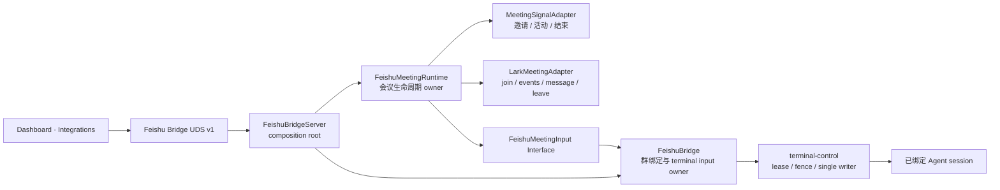
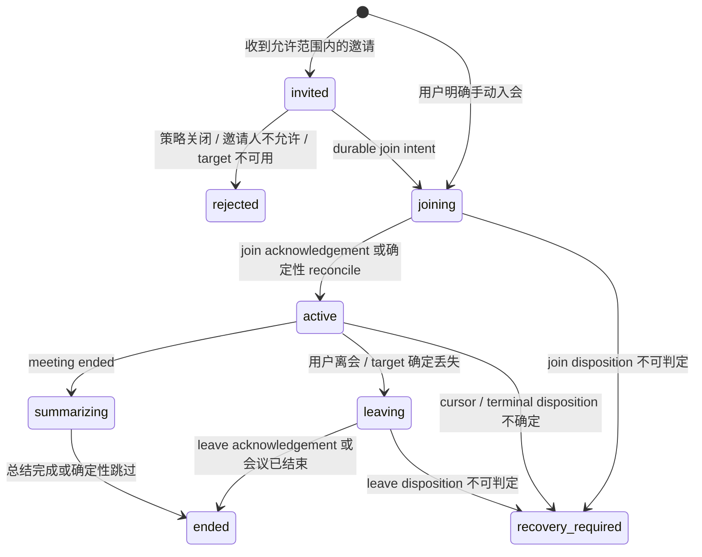

# Feishu Meeting Agent 集成方案

> 状态：提案，尚未实现。本文描述 `tmux-worktree` 如何在不复制凭证、不新增 terminal ownership、也不把会议生命周期塞进现有 IM turn 状态机的前提下，支持飞书机器人真实入会。本文不是当前能力说明。

## 目标

第一阶段交付一个无语音的会议 Agent：

1. 用户可以从 Dashboard 明确选择一条现有 Feishu 群绑定作为“会议 Agent”。
2. 用户可以手动输入 9 位会议号让机器人入会。
3. 自动接听启用后，只有允许名单中的邀请人可以触发入会。
4. 机器人入会后持续读取字幕、聊天、参会人变化和共享文档事件，并把有序、去重、有限大小的会议批次交给已绑定 Agent。
5. 群消息继续作为实时提问和 steering 入口；会议结束后，Agent 的最终总结以顶层卡片发送到绑定群。
6. 会议、terminal input、群回复和重启恢复都保持 fail closed，不猜测不确定副作用。

第一阶段不包含：

- 原始音频收发、实时语音模型或机器人开口说话；
- 云端 7×24 会议网关；
- 远端 SSH target；
- 自动把 Agent 任意终端输出发到会议；
- 一个 bot profile 同时参加多场会议。

## 当前基线与硬约束

当前仓库已有：

- 一个由 Dashboard 按需拉起、退出 Dashboard 时不会被主动杀死的本地 Feishu Bridge daemon；
- `lark-cli` profile、群事件消费、事件去重、群绑定、turn、持久回复、重启恢复和 consumer health；
- target-scoped terminal-control authority，以及 Feishu 对 interactive writer 的独占 lease/fence；
- Dashboard 中的 bot profile 与群绑定管理；
- `lark-cli vc +meeting-join`、`+meeting-events`、`+meeting-message-send` 和 `+meeting-leave`。

必须维持的约束：

1. `lark-cli` 继续拥有 App Secret 和 token。`tmux-worktree` 不读取 `lark-cli` 私有文件、不把 Secret 写进自身配置，也不引入第二份凭证存储。
2. `FeishuBridge` 继续拥有 Feishu 到 terminal 的 canonical input、turn correlation 和 outbound reply。
3. `terminal-control` 继续拥有 target lease/fence 与 single-writer 顺序。会议模块不直接写 tmux、PTY 或 Agent stdin。
4. Relay 与 Feishu 不共享 transport、credential 或业务协议。
5. 机器人真实入会是可见写操作；手动入会必须由用户明确触发，自动接听必须由显式策略授权。

### 当前事件缺口

自动接听需要：

- `vc.bot.meeting_invited_v1`
- `vc.bot.meeting_activity_v1`
- `vc.bot.meeting_ended_v1`

当前 `lark-cli event` 目录尚未暴露这三个内测 EventKey。实施自动接听前必须让下面的 schema 检查成功：

```bash
lark-cli event schema vc.bot.meeting_invited_v1 --json
lark-cli event schema vc.bot.meeting_activity_v1 --json
lark-cli event schema vc.bot.meeting_ended_v1 --json
```

在此依赖满足前，Dashboard 只能提供显式手动入会，不能把“事件订阅已在开放平台配置”误报成“自动接听可用”。

## 选定设计

新增一个深模块 `FeishuMeetingRuntime`，与现有 `FeishuBridge` 运行在同一个 daemon 中。

- `FeishuMeetingRuntime` 拥有会议策略、邀请去重、入会生命周期、会议游标、批次准备和重启恢复。
- `FeishuBridge` 继续拥有群绑定、terminal lease、群 turn、Agent 输出 correlation 和卡片投递。
- `LarkMeetingAdapter` 只适配飞书入会、事件读取、会中文字和离会。
- `MeetingSignalAdapter` 只适配三个会议推送信号。
- `FeishuBridgeServer` 只做装配、UDS 管理和进程生命周期，不成为会议业务 owner。



### 为什么不直接扩写 `FeishuBridge.handleEvent`

IM 消息和会议生命周期有不同的幂等键、恢复规则、游标和隐私策略。直接把会议分支加进当前 `handleEvent` 会让一个方法同时承担：

- 群消息验证与 mention 策略；
- 邀请授权与可见入会；
- 会中事件分页；
- 长会议批次压缩；
- 会议结束与最终总结。

这会形成浅 Interface 和分散状态。独立的会议模块让调用者只需要理解少量管理操作，会议复杂度留在实现内部。

### 为什么仍复用现有 Bridge

会议字幕最终会进入同一个 Agent terminal。若会议模块直接拿 terminal-control lease，就会与群绑定形成第二个 Feishu owner 和第二条写路径。会议模块必须通过现有 Bridge 提供的窄 Interface 交付批次：

```ts
interface FeishuMeetingInput {
  preflight(bindingId: string): Promise<MeetingRouteSnapshot>;
  submitBatch(input: PreparedMeetingBatch): Promise<AcceptedMeetingBatch>;
  requestFinalSummary(input: MeetingSummaryRequest): Promise<void>;
}
```

这三个方法隐藏：

- exact target 与 lifecycle 校验；
- Feishu lease/fence；
- 与活跃群 turn 的串行关系；
- deterministic operation ID；
- rendered snapshot correlation；
- 顶层总结卡片的 durable outbound disposition。

群 turn 优先于后台会议批次。群 turn 活跃时，会议批次由会议模块合并并等待；不得越过 turn，也不得创建竞争 turn。

## 产品模型

### MeetingPolicy

第一版策略绑定到一条已有的 Feishu 群绑定：

```ts
interface MeetingPolicy {
  enabled: boolean;
  autoAnswer: boolean;
  bindingId: string;
  allowedInviterIds: string[];
  leaveOnTargetLoss: true;
}
```

规则：

- `enabled=false` 为默认值。
- `autoAnswer=true` 时，`allowedInviterIds` 必须非空；空列表不是“允许所有人”。
- `bindingId` 必须对应当前 profile 下 active 且 exact target 可复核的群绑定。
- 一个 profile 同时最多一场 active meeting。
- 第一版输出固定进入绑定群；会中文字发送仅接受显式用户动作，Agent 不能靠普通终端文本触发。
- target 在入会前不可用时不入会；入会后 target 确定消失时，默认执行受控离会并记录原因。

### MeetingSession

会议状态只保存恢复所需事实：

```ts
interface MeetingSession {
  id: string;
  state:
    | "invited"
    | "joining"
    | "active"
    | "summarizing"
    | "leaving"
    | "ended"
    | "rejected"
    | "recovery-required";
  bindingId: string;
  inviteEventId?: string;
  callId?: string;
  inviterId?: string;
  meetingNo: string;
  meetingId?: string;
  pageToken?: string;
  joinedAt?: string;
  lastEventAt?: string;
  completedAt?: string;
  error?: string;
  pendingBatch?: PreparedMeetingBatch;
}
```

不持久化完整会议字幕历史。只允许持久化一个有界 pending batch，用于在 terminal input disposition 明确前恢复；批次被接受后立即删除正文，只保留游标与摘要元数据。

## 生命周期



### 邀请与入会

1. 用 `event_id` 和 `call_id` 去重。
2. 在任何可见入会前先完成：
   - policy 与 inviter allowlist 校验；
   - binding/target preflight；
   - consumer 与 meeting capability 检查；
   - `joining` intent 原子持久化。
3. 调用 `+meeting-join --as bot --meeting-number ... --call-id ...`。
4. 保存返回的长 `meeting.id`；后续读取和离会沿用应用身份。
5. join acknowledgement 丢失时不得盲目重试。用 inviter 与 meeting number 查询 bot 当前可见 active meeting：
   - 唯一匹配则采用该 `meeting_id`；
   - 无法唯一确认则进入 `recovery-required`。

### 会中事件

推送信号只作为低延迟 wake-up，`+meeting-events` 的分页结果才是可恢复的 canonical 数据源：

1. active meeting 每 10–30 秒轮询，`meeting_activity` 信号可提前唤醒。
2. 沿用上次 `pageToken`，读取结构化 JSON。
3. 标准化并合并字幕、聊天、参会人变化和共享文档事件。
4. 对正文做 UTF-8、安全字符和大小限制；会议内容始终视为不可信输入。
5. 先持久化 `pendingBatch`，再以从 `meetingId + event range` 派生的 deterministic operation ID 调用 `submitBatch`。
6. 只有 terminal-control 明确接受后才推进 `pageToken` 并删除 pending 正文。
7. disposition 不确定时查询 canonical operation 结果；不能确认则进入 `recovery-required`，绝不重放。

初始限制：

- 每批最多 32 KiB UTF-8；
- 每个 meeting 同时最多一个 pending batch；
- 群 turn 活跃期间合并相邻会议批次，最多保留最新 128 KiB，超限时显式标记截断；
- 不把共享文档标题当作文档内容；需要总结共享文档时，由 Agent 通过已有文档能力读取。

### Agent 输入与输出

会中批次是背景上下文，不自动产生公开回复。推荐输入形态：

```text
[Feishu meeting update]
meeting_id: <id>
batch_id: <deterministic id>
range: <start>..<end>

<untrusted_meeting_content>
...
</untrusted_meeting_content>

仅更新会议上下文；除非群内用户明确提问，不要对外发送内容。
```

第一版交互方式：

- 用户在绑定群里 @Bot 提问，继续走现有群 turn、marker 和卡片回复；
- 会议批次在活跃群 turn 结束后继续送入；
- 会议结束后，会议模块通过 `requestFinalSummary` 创建一个 deterministic、marker-correlated 总结请求；
- 最终总结复用现有 rendered snapshot 与 durable outbound lane，以顶层 Card JSON 2.0 发送到绑定群；
- 原始 terminal output、工具调用、composer 和 footer 永远不能直接成为会议卡片正文。

### 会议结束与离会

- `meeting_ended` 信号触发最后一次事件拉取和总结。
- 用户明确离会时调用 `+meeting-leave`。
- target 确定消失时，`leaveOnTargetLoss` 作为用户启用会议策略的一部分执行隐私保护离会。
- 会议已经结束、bot 已不在会中等确定性结果视为离会完成。
- 离会 acknowledgement 不确定时不重复发送离会请求，进入恢复检查。

## Interface 与 Adapter

### FeishuMeetingRuntime Interface

管理端只暴露：

```ts
interface FeishuMeetingRuntime {
  getPolicy(): MeetingPolicySnapshot;
  setPolicy(input: UpdateMeetingPolicy): Promise<MeetingPolicySnapshot>;
  snapshot(): MeetingRuntimeSnapshot;
  join(input: ManualMeetingJoin): Promise<MeetingSessionSnapshot>;
  leave(meetingId: string): Promise<MeetingSessionSnapshot>;
}
```

计时器、事件处理、游标、批次和恢复都是实现细节，不进入 Interface。

### MeetingPlatformPort

这是飞书外部依赖的 Seam：

```ts
interface MeetingPlatformPort {
  join(input: JoinMeetingInput): Promise<JoinedMeeting>;
  readEvents(input: ReadMeetingEventsInput): Promise<MeetingEventPage>;
  sendMessage(input: MeetingMessageInput): Promise<MeetingMessageResult>;
  leave(input: LeaveMeetingInput): Promise<LeaveMeetingResult>;
  listActive(input: ListActiveMeetingInput): Promise<ActiveMeeting[]>;
}
```

生产 Adapter 使用 `lark-cli vc`；测试 Adapter 使用内存状态并支持注入 acknowledgement 丢失、分页和会议结束。

### MeetingSignalSource

```ts
interface MeetingSignalSource {
  start(onSignal: (signal: MeetingSignal) => Promise<void>): MeetingSignalSubscription;
}
```

生产 Adapter 在 `lark-cli` 支持三个 EventKey 后启动三个独立 consumer；它们共享 `lark-cli` 本地 bus，但保留独立 ready/backoff 状态。测试 Adapter 用内存事件流。

不要在 `tmux-worktree` 中直接接入 `@larksuite/node-sdk` 并重新索取 App Secret。若未来必须采用 SDK，应先设计唯一 credential owner 和 macOS 安全存储迁移，不能把读取 `lark-cli` 私有配置当成 Adapter。

## UDS contract 与兼容

保持 `tw-feishu-bridge` protocol v1，通过 capability negotiation 做加法：

```text
meeting.agent.v1
```

计划新增的 closed operations：

- `meeting.policy.get`
- `meeting.policy.set`
- `meeting.snapshot`
- `meeting.join`
- `meeting.leave`

规则：

- 旧 daemon 不声明 `meeting.agent.v1` 时，Dashboard 隐藏或禁用会议设置，不能发送未知 operation。
- 新 daemon 继续支持旧 Dashboard 的全部群绑定操作。
- 会议 policy 与 state 使用独立文件，旧 daemon 不读取也不改写它们。
- occupied legacy daemon 不为会议功能强制重启；按现有 rolling-upgrade 规则等待安全升级。
- 手动 `meeting.join` 和 `meeting.leave` 在 UI/CLI 中均标记为可见写操作并要求明确确认。

## 存储与隐私

计划新增：

```text
~/.tmux-worktree/feishu-meetings-v1.json
```

要求：

- 目录 `0700`、文件 `0600`、跨进程锁、原子替换、严格 schema、损坏时 fail closed；
- 保存 policy、active/recent session、游标、dedup ID 和一个有界 pending batch；
- 不保存 App Secret、access token、会议密码或原始音频；
- 会议密码只作为一次手动 join 的内存参数；
- completed session 保留有界元数据，默认不保留字幕正文；
- 日志只记录 profile、meeting/session 状态和非敏感 ID，不记录字幕、群消息、token 或 Secret。

## Dashboard 体验

`Settings → Integrations → Meeting Agent`：

1. 选择一条当前 profile 的 active Feishu 群绑定。
2. 开启“允许手动入会”。
3. 可选开启“自动接听”，并配置邀请人 allowlist。
4. 展示两个独立健康状态：
   - 群消息 consumer；
   - 会议 signal consumer。
5. 展示当前 meeting topic/number、状态、绑定 session、最近事件时间和恢复错误。
6. 提供“加入会议”和“离开会议”按钮，两者都明确提示参会人可见。

自动接听启用前必须通过：

- profile 与 bot identity 校验；
- 三个 EventKey schema/consumer ready；
- `vc:meeting.bot.join:write` 和 `vc:meeting.meetingevent:read`；
- active group binding 与 exact target preflight。

Dashboard 退出不主动停止已有 daemon 或 active meeting。Mac 睡眠、断网或重启期间不承诺接听；第一版 UI 必须把“本机在线时可用”写清楚，不能描述为 7×24 托管。

## 失败与恢复

| 场景 | 行为 |
|---|---|
| 重复邀请 | 由 `event_id`/`call_id` 去重，不重复 join |
| 邀请人不在 allowlist | durable rejected，不入会 |
| target/binding 不可用 | 不入会，展示原因 |
| join acknowledgement 丢失 | list-active 唯一匹配后 adopt；否则 recovery-required |
| signal consumer 断线 | 独立 backoff；active meeting 继续按游标轮询 |
| event page 已读但 terminal input 不确定 | 不推进游标，查询 operation；无法确认则 fail closed |
| 群 turn 活跃 | 会议批次合并等待，群 turn 优先 |
| target 入会后确定消失 | durable leaving intent，执行隐私保护离会 |
| meeting ended 信号丢失 | 由轮询状态或确定性错误收敛到 summarizing/ended |
| daemon 重启 | 读取 active session，list-active reconcile，绝不盲目 join/leave |
| summary reply acknowledgement 不确定 | 沿用 durable outbound 规则，不盲发 Agent 内容 |

## 分阶段实施

### Phase 0：事件依赖

- 在 `lark-cli event` 中提供三个 `vc.bot.*` EventKey、稳定 schema、ready marker 和 NDJSON。
- 在开放平台发布对应权限与事件订阅。
- 未满足时只开放手动入会。

### Phase 1：手动无语音 MVP

- 新增 `FeishuMeetingRuntime`、storage 和 `LarkMeetingAdapter`。
- 新增 capability-gated UDS operations。
- Dashboard 提供绑定选择、手动 join/leave 和状态。
- 入会后使用分页 API 轮询会议事件。
- 将会议批次安全送入既有 Bridge；会议结束生成群总结。

### Phase 2：自动接听

- 新增 `MeetingSignalAdapter` 与独立 consumer health。
- 落 inviter allowlist、call ID 透传、join reconcile 和 ended wake-up。
- 增加重启、断线和重复邀请测试。

### Phase 3：本机可用性

- 评估 macOS login item，让已启用策略在登录后自动恢复 daemon。
- 增加离线/睡眠状态提示和恢复入口。
- 不把本机模式描述为云托管。

### Phase 4：语音（独立设计）

实时语音需要新的权限、ByteView WebSocket、Frontier/protobuf、PCM 重采样、模型连接、回声和打断策略。它应形成独立的 `FeishuMeetingAudioRuntime`，不能通过扩张文字会议模块的 Interface 混入第一版。

## 代码落点

计划新增：

- `src/feishuMeetingRuntime.ts`
- `src/feishuMeetingStorage.ts`
- `src/larkMeetingAdapter.ts`
- `test/feishu-meeting.test.mjs`

计划修改：

- `src/feishuBridge.ts`：实现窄的 `FeishuMeetingInput`，不转移 lease owner；
- `src/feishuBridgeServer.ts`：装配会议模块、consumer 和 UDS operations；
- `contracts/feishu-bridge/v1/manifest.json`：新增 capability 与 closed operations；
- `app/src/platform/`：新增 capability-gated domain types 和 Backend methods；
- `app/src-tauri/src/features/feishu_bridge.rs`：适配新的 UDS operations；
- `app/src/dashboard/Settings/FeishuIntegrationSettings.tsx`：会议设置与状态；
- `test/feishu-bridge.test.mjs`：UDS 兼容和 rolling-upgrade 行为；
- 相邻 Dashboard/Rust tests 与当前事实文档。

新增独立 test 文件是合理的，因为会议生命周期是新的独立状态机；UDS 和已有群行为仍在原测试族中验证，避免重复覆盖。

## 验证

主要行为证据：

- disallowed inviter 永不 join；
- 重复 invite 只产生一次 join；
- join acknowledgement 丢失能唯一 reconcile，不能唯一时 fail closed；
- page token 只在 terminal operation 明确接受后推进；
- daemon 重启不重复 join、不重放不确定 batch；
- 群 turn 活跃时会议批次等待并有界合并；
- meeting ended 只产生一次 final summary；
- target 丢失触发一次 durable leave intent；
- 旧 daemon/Dashboard 通过 capability negotiation 安全共存。

辅助检查按仓库矩阵执行：

1. 根 `npm run build`；
2. 直接相关的 Feishu meeting 与 bridge tests；
3. Dashboard build/typecheck 和相关 settings/platform tests；
4. Rust `cargo fmt --check`、`cargo check` 与 Feishu adapter tests；
5. 因变更跨 CLI、Dashboard、Rust 和 contract，收敛后运行一次 `npm run verify`。

真实飞书验收必须单独记录，不能被 fake Adapter 测试替代：

- 手动 join/leave；
- 邀请响铃与 call ID；
- consumer 断线重连；
- 字幕/聊天/共享文档事件；
- Mac 睡眠与恢复；
- 会议结束总结。

## 被拒绝的替代方案

### 直接把会议分支加入 `FeishuBridge.handleEvent`

会混合 IM routing、会议游标和入会副作用，扩大 Interface 并降低 locality。

### 会议模块直接调用 terminal-control

会产生第二个 Feishu terminal owner 和第二条 canonical 写路径，破坏现有 lease/fence 设计。

### tmux-worktree 自行保存 App Secret 并启动 Node SDK

会复制 credential owner，增加迁移、Keychain、日志和降级风险。第一版等待 `lark-cli event` 支持。

### 先建云端 Webhook，再转发给本机

需要一条新的 Feishu 专用鉴权 transport、离线队列和本机身份模型；Relay 不能被复用为 Feishu transport。该方案只在明确要求 7×24 托管时另行设计。

### 第一版同时接实时语音

语音的协议、媒体和模型生命周期远大于文字会议，混入会让模块 Interface 变浅，并阻碍无语音能力先交付。
