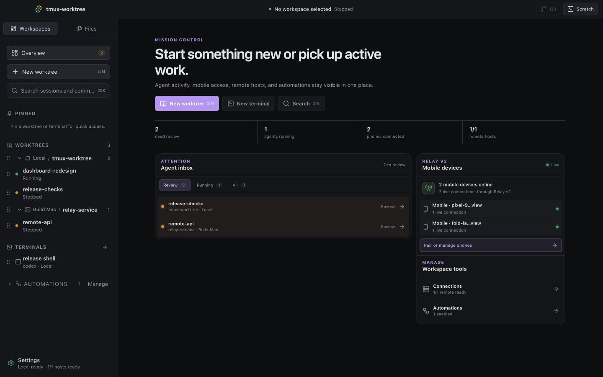
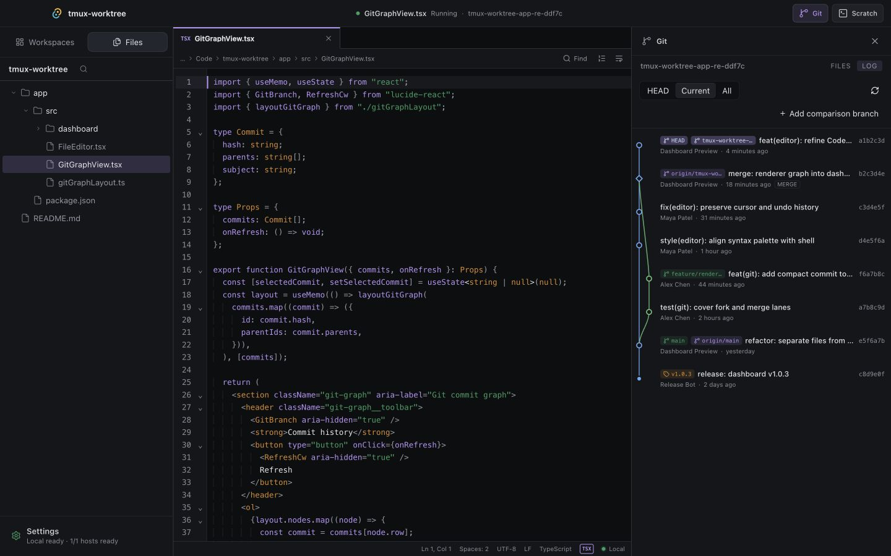

# A day with TW

TW is designed around one simple idea: an AI task should feel like a durable workspace, not a disposable terminal tab.

## 09:00 — Start three tasks, not three messes

Open **New worktree** and choose the repository, base branch, agent, and machine. TW gives the task its own branch, Git worktree, and managed tmux session. Start a UI fix on the Mac, an API refactor on a Build Mac over SSH, and a release review beside them. They can run at the same time without sharing a checkout.

The worktree is not a visual fiction. It is a normal Git worktree that can be inspected from the CLI, opened by other tools, committed, pushed, or removed with Git-aware safety checks.

## 09:15 — Stop asking “which terminal was that?”

Mission Control shows the active catalog by host and project. Running state, recent output changes, and review attention roll up into the overview. The Agent Inbox is deliberately smaller than the full session list: it is the set of work that currently deserves a human decision.

Pick a task and the same workspace opens immediately. The live terminal is still there, including tmux-backed history and the agent's native interface. TW coordinates the session; it does not replace the agent.

## 09:25 — Inspect the answer, not just the prose

Open **Files** to browse or search the task's worktree. Source files open in the built-in editor, Markdown can be previewed, and the Git panel shows the branch, changed files, diffs, and commit topology.

This is where TW becomes more than a terminal organizer: the agent's conversation and the code it changed remain part of one navigable task context.

## 12:10 — Leave the desk without abandoning the task

The remote Build Mac remains in the same catalog as the local machine. A paired Android device can see the managed sessions exposed through Relay v2 and continue supported agent or terminal interactions.

For team-visible work, bind one local managed session to an authorized Feishu group. A precise @Bot message can steer the active turn, and the final response returns to the configured topic or message stream. The binding refers to an exact terminal lifecycle, not merely a reusable session name.

## 14:00 — Take the keyboard back deliberately

Desktop, controlled CLI, Relay, Android, and Feishu can observe the same task, but supported input paths do not treat observation as permission to type. Terminal-control grants target-scoped input ownership, serializes writes, and fences stale owners during a Feishu-to-local handoff.

The result is a product rule you can feel: handoff is explicit. If TW cannot prove that an input or ownership transition is safe, it fails closed instead of replaying a possibly executed command.

## 17:30 — Turn today's routine into tomorrow's Automation

Save the release review, dependency audit, or daily summary as an Automation. Choose a project, agent command, instruction, cron schedule, timezone, and overlap policy. Each run becomes another inspectable session rather than disappearing into a background log.

The scheduler currently belongs to the running Dashboard. It is a local productivity feature, not a hosted always-on service.

## What TW deliberately does not become

TW does not provide its own coding model. It does not move repositories into a proprietary cloud. It does not pretend every terminal agent has the same structured protocol. It coordinates tools and machines you already control, then exposes the smallest control plane necessary to keep their work isolated, visible, and recoverable.

That is the whole promise:

> Your agents. Your machines. One control room.
